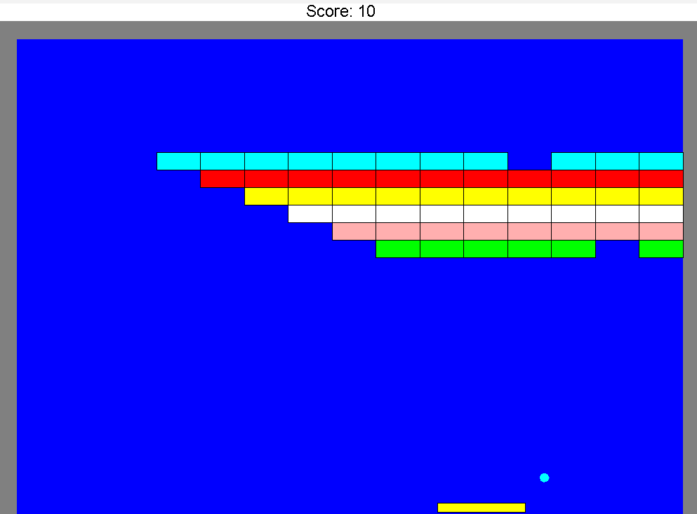

# Arkanoid Game

Welcome to the Arkanoid game project!  
This game was developed as part of the Object-Oriented Programming course at Bar-Ilan University, during the second semester of the first year.

## About the Project
This project was originally created as a multi-stage assignment and later improved to further sharpen my OOP skills and Java knowledge.  
The game was developed using **Java**, with **IntelliJ IDEA Ultimate** as the main IDE.  
It runs on a **single thread**, which is quite rare for games of this kind, and does **not use Java’s built-in GUI components** — instead, a custom GUI implementation included in this repository is used.

The game features:
- A **single playable level** with a user-friendly graphical interface.
- **Classic Arkanoid gameplay**: use the paddle to bounce the ball and break all the bricks without letting the ball fall.
- **Smooth, engaging mechanics** with custom-drawn graphics.

## Object-Oriented Principles and Design Patterns Used
Throughout the development, several key OOP concepts and design patterns were applied:

- **Polymorphism and Inheritance:** Used extensively to create flexible and reusable game entities.
- **Observer Pattern:** Manages interactions between game objects like blocks, balls, and score tracking without tight coupling.
- **Builder Pattern:** Simplifies the creation of complex game objects like balls, blocks, limits, and paddles.
- **Strategy Pattern:** Provides flexibility in the way blocks are placed and colored.
- **Decorator Pattern:** Enhances existing animations (e.g., pause screens, keypress listeners) without altering their structure.
- **Generic Collections:** Used linked lists and array lists to manage game objects efficiently.

## How to Play
- **Controls:** Move the paddle using the Left/Right arrow keys (or A/D keys).
- **Objective:** Break all the bricks by bouncing the ball off the paddle. Avoid missing the ball!
- **Power-ups:** Some bricks contain hidden power-ups — catch them to boost your gameplay!

## Additional Notes
The **Observer pattern** helps maintain a clean and modular structure, making it easy to add new features like life counters, score tracking, or power-up effects without modifying core game components.

Enjoy playing, and happy smashing!

